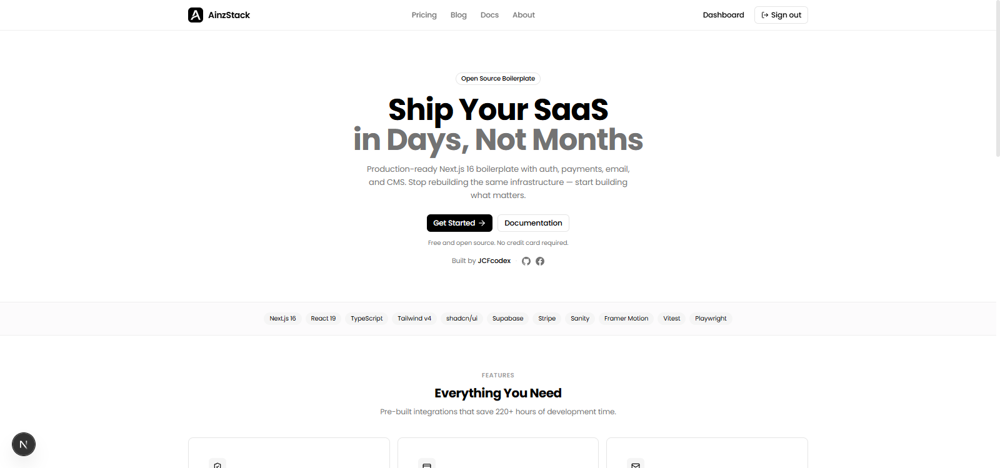

<div align="center">
  
  <br />
  <h1>AinzStack</h1>
</div>

<p align="center">
  <strong>Launch production-ready SaaS applications in days, not months.</strong><br/>
  <em>A modern Next.js 16 architecture integrating authentication, billing, CMS, email, and a polished UI system.</em>
</p>

<p align="center">
  <a href="https://github.com/JCFcodex/AinzStack/actions"></a>
  <a href="#"></a>
  <a href="#"></a>
  <a href="#"></a>
  <a href="#"></a>
  <a href="#"></a>
  <a href="LICENSE"></a>
</p>

---

## Overview

AinzStack provides the foundational momentum required to ship robust software. By abstracting away the boilerplate integration of core SaaS primitives, it allows engineering teams to focus immediately on product logic.

Auth flows are integrated via Supabase. Billing is wired through Stripe. Marketing and dashboard layouts are production-scaffolded. Sanity and Resend form the content and communication layers. CI/CD, typing, and testing are structurally enforced.

### Interface

<p align="center">
  
</p>

---

## Technical Foundation

| Layer               | Implementation                                       |
| :------------------ | :--------------------------------------------------- |
| **Framework**       | Next.js App Router, Turbopack, React 19              |
| **Authentication**  | Supabase (Email/Password, Google OAuth), SSR handled |
| **Database**        | Supabase PostgreSQL                                  |
| **Payments**        | Stripe Checkout, integrated Webhook routing          |
| **Content**         | Sanity CMS client and schema foundation              |
| **Email**           | Resend API integration                               |
| **Styling**         | Tailwind CSS v4, Framer Motion primitives            |
| **State**           | React Query, Zustand                                 |
| **Validation**      | Zod, React Hook Form                                 |
| **Quality Control** | TypeScript (Strict), ESLint, Vitest, Playwright      |

---

## Getting Started

### Prerequisites

- Node.js `v22.0.0` or higher
- pnpm `v10.0.0` or higher

### Initialization

Clone the repository and install dependencies:

```bash
git clone https://github.com/JCFcodex/AinzStack.git
cd AinzStack
pnpm install
```

### Environment Configuration

Duplicate the environment template:

```bash
cp .env.example .env.local
```

Populate `.env.local` with your distinct credentials. Essential variables include:

```env
NEXT_PUBLIC_APP_URL=
NEXT_PUBLIC_SUPABASE_URL=
NEXT_PUBLIC_SUPABASE_ANON_KEY=
SUPABASE_SERVICE_ROLE_KEY=
NEXT_PUBLIC_STRIPE_PUBLISHABLE_KEY=
STRIPE_SECRET_KEY=
STRIPE_WEBHOOK_SECRET=
SANITY_PROJECT_ID=
SANITY_DATASET=
RESEND_API_KEY=
```

### Development Server

Initiate the local environment:

```bash
pnpm dev
```

The application will be available at `http://localhost:3000`.

---

## Architecture

The project enforces a strict, scalable directory structure:

```text
src/
├── app/
│   ├── (auth)/             # Authentication flows
│   ├── (dashboard)/        # Secured application interface
│   ├── (marketing)/        # Public-facing routes
│   └── api/                # Edge and Node.js route handlers
├── actions/                # Server Actions for data mutation
├── components/
│   ├── layout/             # Structural components (nav, sidebar)
│   ├── providers/          # Context and service providers
│   └── ui/                 # Reusable primitive components
└── lib/                    # Core integrations and utilities
    ├── auth/
    ├── sanity/
    ├── stripe/
    └── supabase/
```

---

## Deployment Considerations

When transitioning to production environments, ensure the following constraints are met:

1. **Absolute URLs:** Assign `NEXT_PUBLIC_APP_URL` to your authoritative production domain.
2. **Authentication Callbacks:** Register your production callback URI within the Supabase dashboard (e.g., `https://[domain.com]/auth/callback`).
3. **Webhooks:** Update your Stripe webhook endpoints to target your production deployment.

---

## Commands

A comprehensive suite of scripts is provided for the development lifecycle:

| Command          | Action                                              |
| :--------------- | :-------------------------------------------------- |
| `pnpm dev`       | Start the development server                        |
| `pnpm build`     | Compile the application for production              |
| `pnpm start`     | Run the compiled production server                  |
| `pnpm lint`      | Execute static code analysis via ESLint             |
| `pnpm typecheck` | Validate TypeScript typings                         |
| `pnpm test`      | Run unit testing suite via Vitest                   |
| `pnpm test:e2e`  | Run end-to-end testing via Playwright               |
| `pnpm ci`        | Run full CI workflow (Lint, Typecheck, Test, Build) |

---

## Contributing

We value engineering rigor and clear communication. To contribute:

1. Fork the repository.
2. Checkout a scoped feature branch (`git checkout -b feature/module-name`).
3. Commit your changes with descriptive messages.
4. Execute the validation suite locally (`pnpm ci`).
5. Open a Pull Request detailing your modifications.

---

<div align="center">
  <p>
    <a href="https://github.com/JCFcodex/AinzStack">Repository</a> •
    <a href="https://github.com/JCFcodex/AinzStack/issues">Issue Tracker</a> •
    <a href="https://github.com/sponsors/JCFcodex">Sponsorship</a>
  </p>
  <p>
    <em>Built by <a href="https://github.com/JCFcodex">JCFcodex</a></em><br/>
    <small>Released under the <a href="LICENSE">MIT License</a></small>
  </p>
</div>
