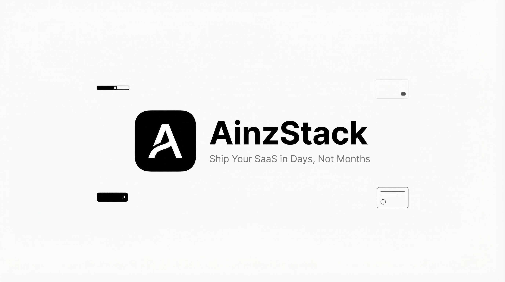

<div align="center">
  
  <h1>AinzStack</h1>
  <p><strong>Launch production-ready SaaS apps in days, not months.</strong></p>
  <p>
    A modern Next.js 16 starter kit with auth, billing, CMS, email, and a polished UI system already wired.
  </p>
</div>

<div align="center">

[](https://github.com/JCFcodex/AinzStack/actions/workflows/ci.yml)


[](LICENSE)

</div>

## Preview

### Hero Preview
<p align="center">
  
</p>

### Product Snapshot
<p align="center">
  
</p>

## Why This Project?

Most boilerplates give you folders. AinzStack gives you momentum.

- Auth flows are already integrated with Supabase (email/password + Google OAuth)
- Billing is wired for Stripe checkout + webhook handling
- Marketing and dashboard routes are scaffolded for real product work
- Sanity and Resend integrations are pre-configured entry points
- CI, linting, typing, unit tests, and E2E tests are part of the workflow

If you want to ship a SaaS faster with fewer integration detours, this stack is built for that.

## Key Features

| Area | What You Get |
| --- | --- |
| App Framework | Next.js App Router + Turbopack |
| Authentication | Supabase auth flow + callback handling |
| Billing | Stripe checkout + webhook route |
| CMS | Sanity client + schema foundation |
| Email | Resend integration scaffolding |
| UI System | Tailwind v4 + reusable UI components |
| Motion | Framer Motion primitives ready to use |
| Data + State | React Query + Zustand |
| Validation | Zod + React Hook Form resolver |
| Quality | ESLint, TypeScript, Vitest, Playwright, GitHub Actions |

## Tech Stack

- `next@16.1.6`, `react@19.2.4`, `typescript@5.9`
- `tailwindcss@4`, `framer-motion`
- `@supabase/supabase-js`, `@supabase/ssr`
- `stripe`, `@stripe/stripe-js`
- `sanity`, `next-sanity`
- `resend`
- `zod`, `react-hook-form`, `@hookform/resolvers`
- `vitest`, `@playwright/test`

## Quick Start

### Prerequisites

- Node.js 22+
- pnpm 10+

### Installation

```bash
git clone https://github.com/JCFcodex/AinzStack.git
cd AinzStack
pnpm install
```

### Environment Setup

```bash
cp .env.example .env.local
```

Configure required values in `.env.local`:

- `NEXT_PUBLIC_APP_URL`
- `NEXT_PUBLIC_SUPABASE_URL`
- `NEXT_PUBLIC_SUPABASE_ANON_KEY`
- `SUPABASE_SERVICE_ROLE_KEY`
- `NEXT_PUBLIC_STRIPE_PUBLISHABLE_KEY`
- `STRIPE_SECRET_KEY`
- `STRIPE_WEBHOOK_SECRET`
- `SANITY_PROJECT_ID`
- `SANITY_DATASET`
- `RESEND_API_KEY`

### Run Locally

```bash
pnpm dev
```

Open `http://localhost:3000`.

## Scripts

| Command | Description |
| --- | --- |
| `pnpm dev` | Start local dev server |
| `pnpm build` | Create production build |
| `pnpm start` | Start production server |
| `pnpm lint` | Run ESLint |
| `pnpm typecheck` | Run TypeScript checks |
| `pnpm test` | Run unit tests (Vitest) |
| `pnpm test:e2e` | Run Playwright E2E tests |
| `pnpm ci` | Run lint + typecheck + test + build |

## Project Structure

```text
src/
  app/
    (marketing)/
    (auth)/
    (dashboard)/
    api/
    auth/callback/
  components/
    layout/
    providers/
    ui/
  lib/
    auth/
    env/
    sanity/
    stripe/
    supabase/
  actions/
  test/
e2e/
.github/workflows/ci.yml
```

## Deployment Notes

- Set `NEXT_PUBLIC_APP_URL` to your real deployed domain (not localhost)
- Add your callback URL in Supabase Auth settings, for example:
  - `https://your-domain.com/auth/callback`
- Configure matching environment variables in your deployment platform

## Contributing

Contributions are welcome.

1. Fork the repository
2. Create a feature branch
3. Make your changes
4. Run checks locally:

```bash
pnpm lint
pnpm typecheck
pnpm test
pnpm test:e2e
```

5. Open a pull request

## License

This project is licensed under the MIT License.
See [LICENSE](LICENSE) for details.

---

<div align="center">
  <strong>Built by <a href="https://github.com/JCFcodex">JCFcodex</a></strong>
  <br />
  <a href="https://github.com/JCFcodex/AinzStack">Repository</a>
  |
  <a href="https://github.com/JCFcodex/AinzStack/issues">Issues</a>
  |
  <a href="https://github.com/JCFcodex/AinzStack/pulls">Pull Requests</a>
  |
  <a href="https://github.com/sponsors/JCFcodex">Sponsor</a>
</div>
